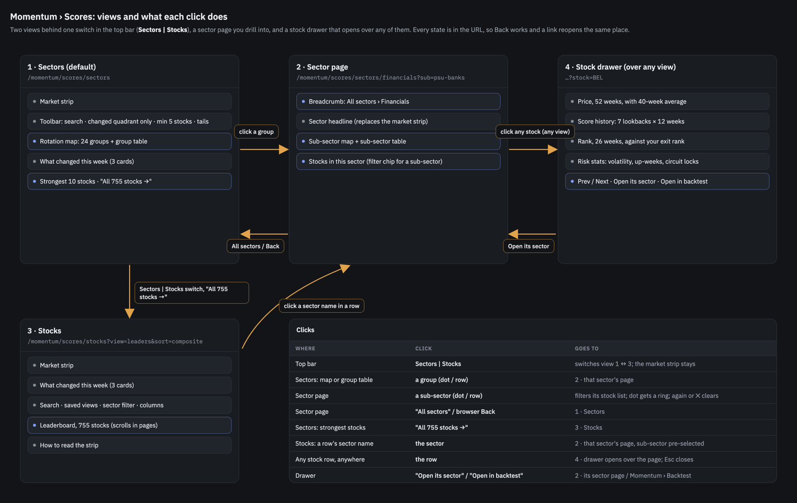
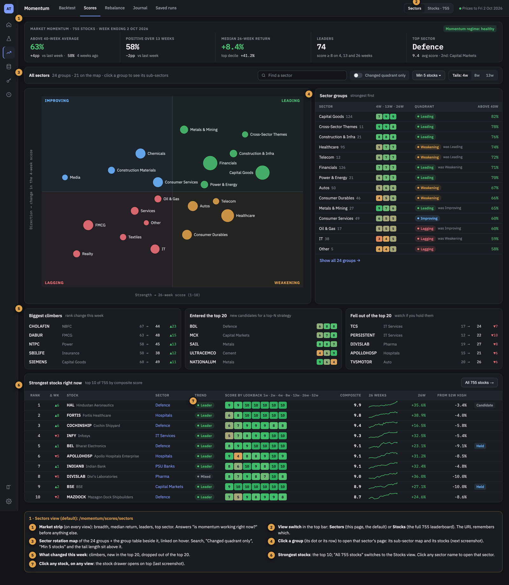
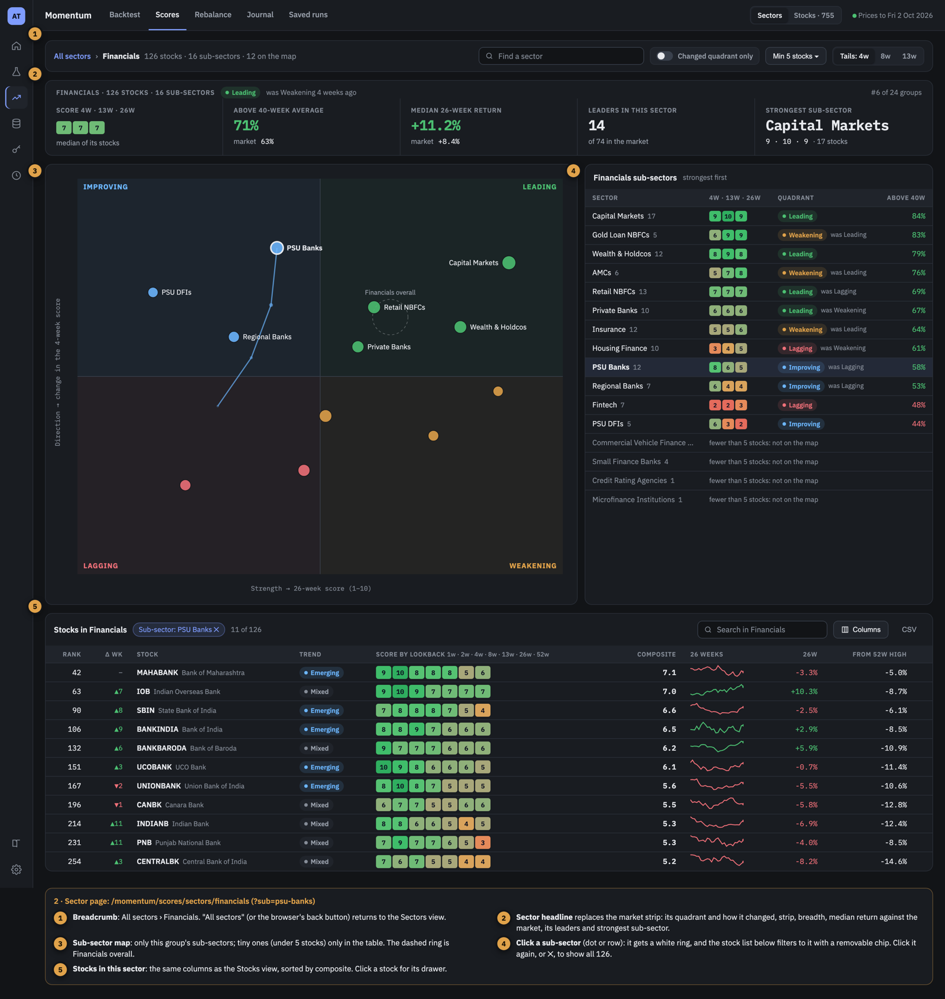
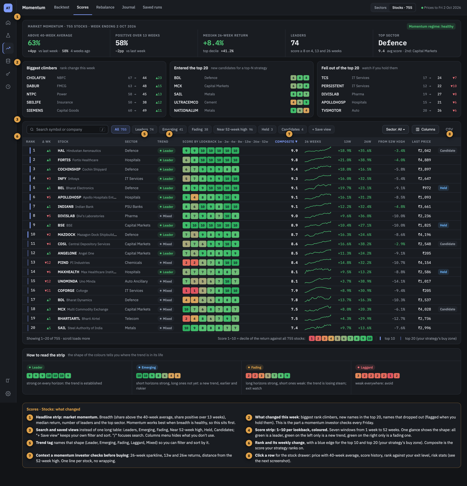
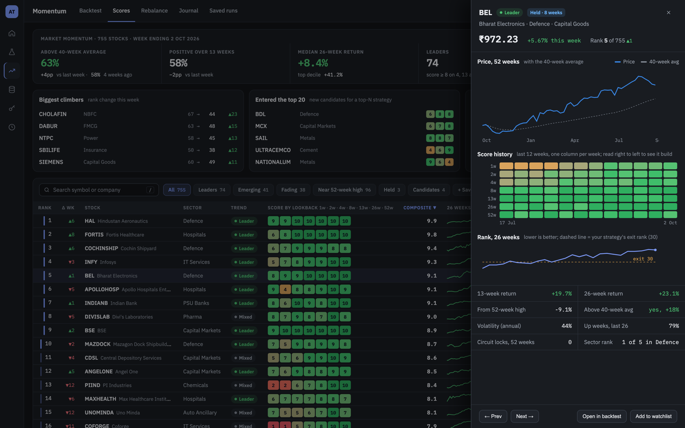

# BL-049 — Momentum Scores redesign: market strip, sector rotation map, 1–10 score strips, stock drawer

| | |
|---|---|
| **Priority** | P2 — makes the research workbench far more useful for picking and watching names; not on the real-money path (BL-010 / BL-025 are) |
| **Status** | Done (2026-10-08) |
| **Type** | feature |
| **Area** | momentum (backend + dashboard) |
| **Created** | 2026-10-07 |
| **Depends on** | the Momentum Backtest redesign (PR #115): the analytics page pattern, the right-hand drawer and the benchmark-picker conventions it introduces |
| **TODO.md row** | 3.12.16 |

## Context

Momentum › Scores today (`components/momentum/MomentumScoresView.tsx`) is one flat table over the
Total Market universe (755 symbols): a 0–100 percentile for the 4, 13 and 26-week returns, the
last price and the 1-week change; a Sectors tab with an expandable list of 113 sub-sectors. All
rows are rendered at once (about 10,000 DOM nodes, see BL-006), nothing shows how the market as a
whole is doing, nothing shows what changed since last week, and a sector's score is a bare number.

The owner asked (2026-10-07) for a page a momentum investor can read in one glance: a market
strength strip, the strongest sectors, a sector rotation map (RRG) that stays readable with the
real number of sectors, a coloured 1–10 score for several lookbacks, search and sorting, and a
clear way to move between sectors and stocks. The design was settled from mockups in the same
session; the five approved screens are below (sample data, real sector names).

| Screen | Image |
|---|---|
| Page map: views and what each click does |  |
| 1 · Sectors view (the default) |  |
| 2 · Sector page (Financials) |  |
| 3 · Stocks view |  |
| 4 · Stock drawer |  |

### The design in brief

- **Two views behind one switch** in the top bar, `Sectors | Stocks` (default **Sectors**), a
  **sector page** you drill into by clicking a group, and a **stock drawer** that opens over any
  view when a stock row is clicked. Every state is in the URL (`/momentum/scores/sectors`,
  `/momentum/scores/sectors/<group>?sub=<sub-sector>`, `/momentum/scores/stocks`, `?stock=BEL`),
  so Back works and a link reopens the same place.
- **Market strip** on both views: share of stocks above their 40-week average (and one and four
  weeks ago), share positive over 13 weeks, median 26-week return, number of leaders, top sector.
- **What changed this week**: biggest rank climbers, new names in the top 20, names that dropped
  out of it (flagged if held).
- **Score strip:** a 1–10 decile of each stock's return against all scored stocks, for 1w, 2w, 4w,
  8w, 13w, 26w and 52w, coloured red to green. The shape names a **trend tag**: Leader (strong
  everywhere), Emerging (short windows strong, long ones not yet), Fading (long strong, short
  weak), Laggard, Mixed.
- **Composite** is Broad Momentum's own ranking (rank-sum over 1, 4, 13, 26 and 52 weeks,
  `engine.compute_ranks`), so the order matches what the strategy would pick. A blue edge marks
  the buy zone (top-N) and the drawer draws the exit rank, both from the Telegram-active Broad
  favourite (`broad_off_top_n` / `broad_off_exit_rank`), falling back to Broad's defaults 10 / 20.
- **Rotation map (RRG)** of the **24 parent groups** (about 21 dots: groups under 5 stocks are
  table-only; Cross-Sector Themes is table-only because its stocks already sit in real sectors).
  X is the 26-week score, Y the change in the 4-week score; quadrants Improving, Leading,
  Weakening, Lagging. Labels for Leading/Improving, the selected and the hovered dot only; the
  4-week tail appears on hover; the table beside it is linked by hover. "Changed quadrant only",
  "Min 5 stocks", tail length 4/8/13 weeks and a sector search sit above it.
- **Sector page:** the same map for that group's sub-sectors (≤ ~15 dots; a dashed ring marks the
  group overall), a sector headline in place of the market strip, the sub-sector table, and the
  stocks in the sector with the same columns as the Stocks view. Clicking a sub-sector filters the
  stock list (a removable chip).
- **Stocks view:** search (`/` focuses it), quick views (Leaders, Emerging, Fading, Near 52-week
  high, Held, Candidates), sector filter, Columns menu, rank with weekly change, score strip,
  trend tag, 26-week sparkline, 13w/26w returns, distance from the 52-week high, Held/Candidate.
- **Stock drawer:** price with its 40-week average (52 weeks), score history (7 lookbacks × 12
  weeks), 26-week rank against the exit rank, volatility, up-weeks, circuit locks (Phase 3),
  Prev / Next, Open its sector, Open in backtest.

Follows the **analytics page pattern** introduced by the Backtest redesign (run bar replaced here
by the view switch and toolbar, headline strip, first-screen rule, follow tooltip, one-line dense
rows, progressive loading, drawer instead of a permanent side column).

## Goal

- A momentum investor can answer "is momentum working, which sectors are leading or turning, which
  stocks are the strongest, and what changed this week" from the first screen, and open any sector
  or stock in one click.
- Warm page load under 1 s; sorting and filtering under 100 ms with under 2,000 DOM nodes (this
  supersedes BL-006); the rotation map never draws more than about 25 dots.
- Every number on the page is reproducible from the weekly price frame the engine already loads:
  nothing is invented (no market cap, which has no data in this repo).

## Out of scope

- Market cap, fundamentals and anything that needs data this repo does not have.
- Reproducing the strategy's exact picks: those need Broad's pool and category steps (about 20 s
  cold). The composite here is the same rank-sum on the same frame, so it is close but not a
  promise of what the strategy trades; the page says so.
- Alerts or Telegram messages from the Scores page.
- Changing how any backtest ranks or trades.

## Plan

Facts this plan relies on (checked 2026-10-07):

- The payload is built in `api.py` (`_momentum_scores_payload`) from
  `categories/momentum_scores.py` (`_percentile_scores`, `_returns_at`,
  `DEFAULT_LOOKBACKS = (4, 13, 26)`); FastAPI serves it at `/api/momentum-scores`. The Fastify
  route `apps/server/src/server/routes/momentum-backtest.ts` (about line 75) forwards only that
  path and **drops the query string**, and `apps/dashboard/next.config.ts` (about line 61) has the
  matching direct rewrite: any new parameter or endpoint is added in both.
- The universe frame (about 821 weekly closes × about 800 columns, back to 2011) is cached in
  memory by file mtime and `db_read.data_version()`; a cold build is about 7 s, a warm request
  well under a second. `stock_membership` gates every historical week and must be applied per
  week when history is computed.
- A sector's score today is the **mean** of its members' percentiles. There is no parent-group
  score.
- `curated/stock_groups.csv` has 825 rows for 755 symbols (24 parent groups, 113 sub-sectors);
  65 symbols carry two tags, and the stock row's sub-sector is "last row wins". Every reader uses
  `DictReader`, so a `short_name` column breaks nothing (it changes `input_version()` once, which
  invalidates cached backtests).
- Broad's composite is `engine.compute_ranks(full_frame)`; its last 26 rows are exactly
  reproduced from the last ~80 rows of that frame.
- The dashboard has no drawer primitive (the Backtest redesign adds one), no virtualisation
  library, `useAppRoute.navigate` drops a `?query`, and `useQueryState` is replace-only.
- `lib/momentumScores.ts` `signalMarks` uses `config.top_n` (5, unused for Broad) instead of
  `broad_off_top_n`, and Broad signal assets can be split names such as `SYM#2`: both are fixed
  here, otherwise Held/Candidate and the buy-zone edge are wrong.

### Phase 1 — Stocks view and market strip (this week's data)

- **Tasks (backend):** lookbacks 1, 2, 4, 8, 13, 26, 52 with a 1–10 decile each; composite rank
  from `compute_ranks` for this week and last week (for the weekly change); per stock: distance
  from the 52-week high, % above the 40-week average, 52-week volatility, up-weeks of the last
  26, a 26-point sparkline; a deterministic primary sub-sector plus all tags; a `breadth` block
  (above the 40-week average now, 1 and 4 weeks ago, positive over 13 weeks, median and
  top-decile 26-week return, leader count, top sector). Cached next to the universe frame.
- **Tasks (dashboard):** market strip; the three "what changed" cards; the leaderboard (search,
  quick views, sector filter, Columns menu, score strip, trend tag, rank + change, buy-zone edge,
  sparkline); paged rendering ("Show 100 more") with memoised rows and `useDeferredValue`
  (absorbs BL-006); decile colours as literal Tailwind classes (checked by
  `tailwindClasses.test.ts`); trend tag, movers and breadth helpers as pure functions in
  `lib/momentumScores.ts`; the `signalMarks` fix.
- **Also:** update `guide/content/momentum/scores.md` and add glossary terms (score/decile,
  trend tag, breadth, Held/Candidate, rotation quadrant); Python tests for every new field
  (hand-built fixtures, as in `tests/categories/test_momentum_scores.py`); lib tests; rewrite the
  e2e spec `e2e/momentum-chart.spec.ts` ("Momentum Scores exposes stock and sector details").
- **Deliverables:** the Stocks view as in screenshot 3, on its own route
  `/momentum/scores/stocks`.
- **Done when:** warm load under 1 s; sort and filter under 100 ms; under 2,000 DOM nodes;
  the e2e spec and the new tests pass; the guide page matches the screen.

### Phase 2 — Sectors view, sector page, rotation map, stock drawer (needs history)

- **Tasks (backend):** scores for parent groups (mean over each group's unique member symbols)
  and sub-sectors at now and 4, 8 and 13 weeks back, using the per-week membership gate; quadrant
  now and 4 weeks ago; breadth and leaders per group and sub-sector; a per-stock endpoint for the
  drawer (52 weekly closes with the 40-week average, 12 weeks × 7 deciles, 26 weeks of composite
  rank, stats) so the main payload stays small; `short_name` on sub-sectors in the curated file;
  the new endpoint added to the Fastify proxy and the Next rewrite.
- **Tasks (dashboard):** routes under `/momentum/scores/sectors/<group>` with `?sub=` and
  `?stock=` (extend `navigate` to carry a query string, back-button safe); the SVG rotation map
  with linked hover, tails on hover, "Changed quadrant only", "Min 5 stocks", tail length and
  search; the sector headline, sub-sector table and stocks-in-sector list; the stock drawer on
  the shared drawer primitive; the `Sectors | Stocks` switch with Sectors as the default.
- **Deliverables:** screenshots 1, 2 and 4.
- **Done when:** every click in the page map works and Back returns to the previous state; the
  drawer opens in under 500 ms warm; the map never shows more than about 25 dots; opening the
  page cold does not fetch drawer data.

### Phase 3 — Extras

- **Tasks:** saved views kept in the browser (`store/momentumView.ts` pattern); circuit locks over
  52 weeks in the drawer (the run query in `categories/circuit_exposure.py`, through
  `stock_bars()`); "Open in backtest" (pre-fills a Broad run); the "How to read the strip" card.
- **Done when:** each works and has a test; the guide page covers them.

## Risks

- **Payload size.** 755 stocks × 7 deciles, sparklines and breadth is a few hundred KB (gzip is
  on). History stays out of it: group history comes with the sector payload and per-stock history
  with the drawer endpoint.
- **Membership at past weeks.** Scoring a past week without that week's `stock_membership` would
  rank forward-filled "zombie" columns. Tests must cover it.
- **Multi-tagged symbols** (65) are counted once in a parent group but may sit in two sub-sectors;
  the stock row needs a deterministic primary tag and the sub-sector filter must accept either.
- **Composite is not the strategy's pick** (see Out of scope); label it as the ranking, not a
  signal.
- **Partial week.** `as_of` can be a partial week (the frame is resampled to Friday); the page
  shows the date and does not treat a partial week as a close.
- **Sub-5-stock groups** swing on one stock; they stay table-only.

## Open questions

All answered 2026-10-08, see the Log.

## Log

- 2026-10-07 — created from the redesign session. Owner decisions: Sectors is the default view;
  composite is Broad's own ranking; Cross-Sector Themes is table-only; the buy zone and exit rank
  come from the active favourite (fallback 10 / 20); build after the Backtest redesign
  (PR #115). Supersedes BL-006 (paging and memoised rows are in Phase 1).
- 2026-10-08 — started. Owner answers: "Open in backtest" just opens the Backtest tab on Broad
  Momentum (no pre-filled sector); the map's 5-stock minimum is a default the reader can change
  (kept in the browser); the Stocks view always opens on All (saved views, Phase 3, are how a
  favourite filter is kept).
- 2026-10-08 — Phase 1 built (branch `feat/bl-049-scores-phase1`). What it does and where it
  differs from the plan:
  - Backend: seven lookbacks; Broad's rank-sum rank this week and last (`compute_ranks` on the
    last 60 weeks of the page's own live members, so it is the strategy's formula over this
    page's stocks, not its exact pick); per-stock 52-week-high gap, 40-week average gap,
    52-week volatility, up-weeks and a 26-week line; a `breadth` block; deterministic primary
    sub-sector plus every tag. Rounded JSON. On the live data: 745 scored, 707 ranked, warm
    0.4 s, cold 8 s (the frame load), 669 KB raw before gzip.
  - Dashboard: market strip, three movers cards, the paged leaderboard (search with `/`, quick
    views with counts, sector filter, Columns menu, sorting by rank, lookback, return, 52-week
    high), the 1–10 strip and trend tag, Held/Candidate beside the stock. Decile colours are
    token classes. The Sectors tab stays a table (with strips) until Phase 2.
  - **The "Composite" column became the Rank column**: the rank is what the strategy uses; a
    second 0–10 number would be a second ranking to explain.
  - Climbers are counted only among stocks now ranked in the top 100 (a jump from 600th to 300th
    is noise to a strategy that buys the top ten).
  - No market-regime badge (it needed thresholds nobody has validated).
  - Fixed on the way: Held/Candidate used Broad's unused `top_n`; split names like `SYM#2` did
    not match; `Td`/`Th` gained a `dense` option (the one-line row rule), and `ui/CheckboxMenu`.
  - Not done in Phase 1, by design: the stock drawer, the rotation map, score history (Phase 2).
- 2026-10-08 — Phase 2 built (branch `feat/bl-049-scores-phase2`, stacked on Phase 1). What it
  does and where it differs from the plan:
  - Backend: `weekly_percentile_scores` (the same row-wise percentile as the current one, masked
    by each week's membership); `compute_rotation` gives the 24 parent groups and every
    sub-sector 18 weeks of mean 4 and 26-week scores (members counted once per symbol, themes
    flagged); `composite_rank_history` (26 weeks, cached per universe); `stock_detail` and
    `GET /api/momentum-scores/stock/{symbol}` (404 for a symbol not scored this week), with the
    Fastify route `/api/momentum/scores/stock/:symbol` and the Next rewrite. Main payload gains
    `rotation`; the stock history is fetched only when a drawer opens.
  - Dashboard: `Sectors | Stocks` switch (Sectors default; the address is
    `/momentum/scores/<sectors|stocks>[/<group>]?sub=&stock=`, read through `useScoresRoute`
    on the history API, so Back, deep links and Esc all work; the drawer's own history entry is
    marked so closing steps back instead of stacking). Rotation map (x = 26-week score, y = change
    in the 4-week score over 4 weeks) with linked hover, tails of 4/8/13 weeks, search, "Changed
    quadrant only", an adjustable minimum of stocks (default 5, kept in the browser); sector page
    with its own map of sub-sectors, a sub-sector filter and its stocks; the stock drawer
    (`ui/Drawer`) with figures, price + 40-week average, score history and rank history, Prev/Next
    through the list it was opened from, Open its sector and Open in backtest.
  - Cross-Sector Themes are in the table only, as decided; groups under the minimum are also
    table-only and say why.
  - The old `SectorsTable` is deleted; the guide page and glossary (`rotation-map`) are updated.
  - `ui/Drawer.tsx` is the same file as in #123 (the Backtest follow-ups); whichever merges
    second takes the other's copy as is.
  - Not done, by design: `short_name` on sub-sectors (labels fit without it), saved views,
    circuit locks and the strip-reading card (Phase 3).
- 2026-10-08 — Phase 3 built (branch `feat/bl-049-scores-phase3`, stacked on Phase 2). What it
  does and where it differs from the plan:
  - **Saved views** (`store/momentumScoresViews.ts`, own key `ata.momentumScoresViews.v1`, so the
    Phase 2 store and its stored key are untouched): a **Views** menu beside Columns on the Stocks
    view only (not on the sector page or the overview's top ten). A view keeps the quick view,
    sector group, search text and sort; names are unique ignoring case (saving an existing name
    replaces it), at most 12, 40 characters. Applying is always an explicit pick: the list still
    opens on All (owner decision), and **All stocks** in the menu returns to the default. A view
    whose sector or lookback has since disappeared opens with all sectors or the rank order rather
    than an empty list. Delete is a submenu so every action is keyboard reachable.
  - **Circuit locks over 52 weeks** in the drawer: a sibling endpoint
    `GET /api/momentum-scores/stock/{symbol}/circuits` (Fastify
    `/api/momentum/scores/stock/:symbol/circuits`, Next direct rewrite), fetched by the drawer
    only once it is open, in parallel with its history, and with its own error and Retry. It runs
    the daily-bar query of `circuit_exposure.py` through `stock_bars()` for one symbol and groups
    runs with the same `_runs`, so the definition is the backtest card's: a lock is **3 or more**
    sessions on one band edge in one direction (`LOCK_MIN_DAYS`, the owner's rule); shorter runs
    are ordinary moves and are not listed. A lock that began before the window but reaches into it
    is listed whole. Newest first, at most 12 listed with the total counted; `ongoing` marks a run
    that reaches the stock's latest session. 404 for a symbol the page does not score, 503 if the
    daily bars are missing. `live_column` was lifted out of `stock_detail` so both endpoints share
    the one membership check.
  - **"How to read the strip" card** (`scores/StripGuide.tsx`) on all Scores views: the 10-step
    colour key, which end is recent, and one example strip per trend tag. The examples live in
    `lib/momentumScores.ts` and a test runs each through `trendOf`, so the card cannot teach a
    shape the page names differently.
  - Judgement calls, conservative defaults (owner may change): the card starts **open on a first
    visit** and "Got it" folds it to a one-line toggle that stays on the page (remembered in the
    browser); saved views keep the search text as well as the filters; a view is never applied on
    load; the lock threshold is 3 sessions, not the 2 that `circuit_exposure`'s escape analysis
    uses.
  - "Open in backtest" already opened the Backtest tab on Broad Momentum (owner answer); left as
    is.
- 2026-10-08 — review fixes after `/code-review` of #124 and #125 (branch `fix/bl-049-review-findings`):
  the market strip's strongest sub-sector skips theme baskets; the scores payload (snapshots and
  rotation) is kept per price frame and group file (`UniverseMemo`, held weakly) instead of rebuilt
  per request; the rank-history cache is keyed by week count too and built under a lock; the stock
  proxy refuses dot-only names; `openStock` keeps one identity so rows stay memoised; `/` is not
  taken where there is no search box; the rotation panel and map no longer recompute on hover; the
  drawer's rank total counts ranked stocks; dead sector-table helpers removed.
- 2026-10-08 — closed. All three phases and the review fixes are on main (#124, #126, #127, #128).
  Phase 3 has a Playwright test (`e2e/momentum-chart.spec.ts`: a saved view applied and kept
  across a reload with the list still opening on All, the strip guide folded and remembered,
  circuit locks fetched only once a drawer opens); the suite is not in CI. Loose ends: a
  "two children with the same key, AXISCADES" console warning seen once in a dev session could not
  be reproduced on live data (745 unique symbols; no warning across every group, sub-sector,
  drawer and quick view); `short_name` for sub-sectors was dropped, labels fit without it.
