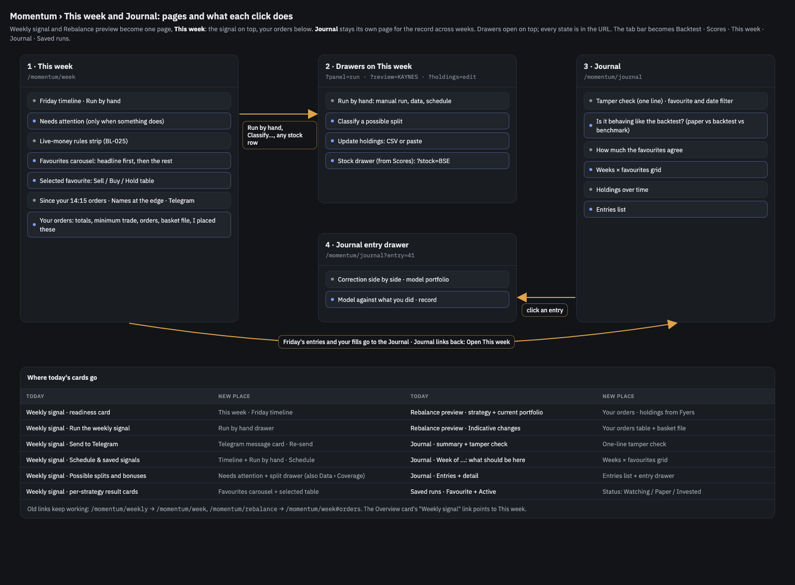
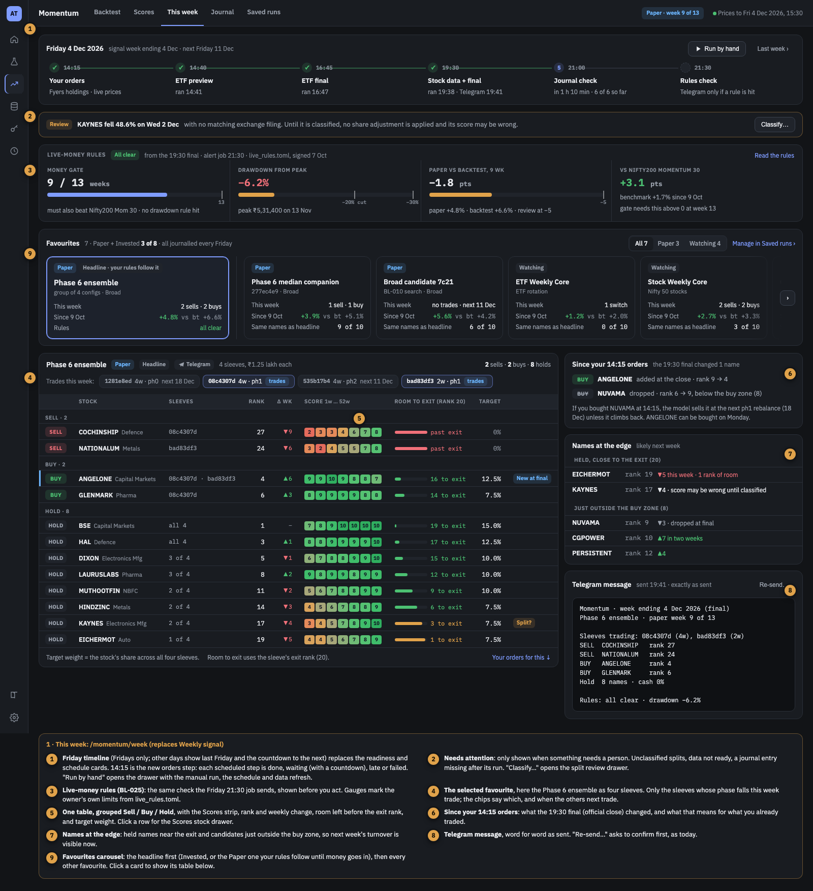
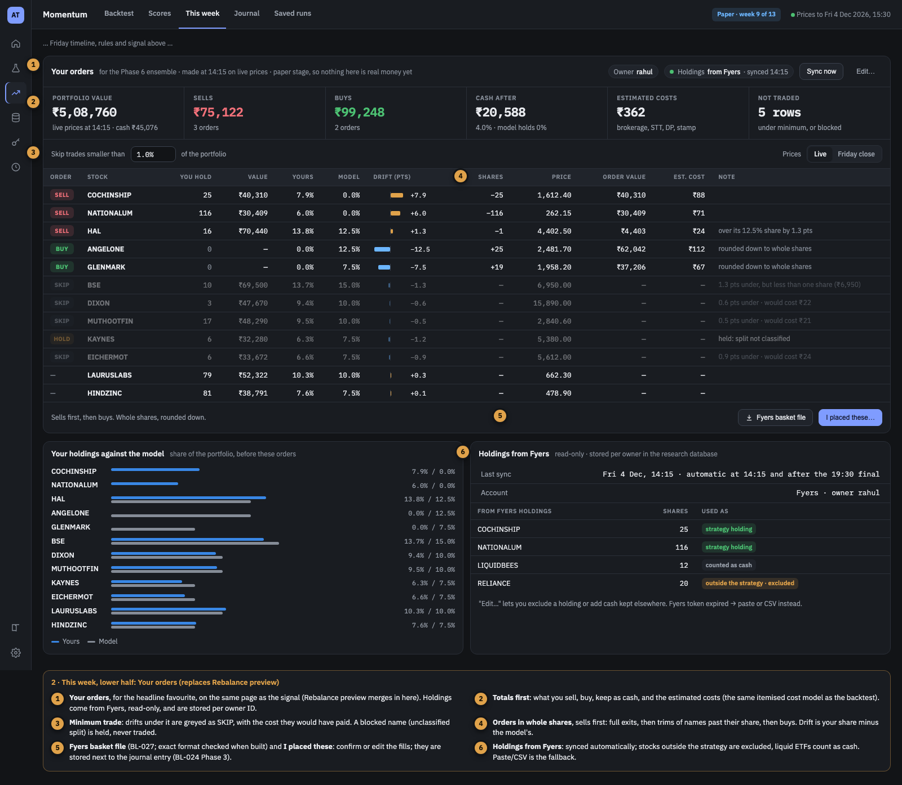
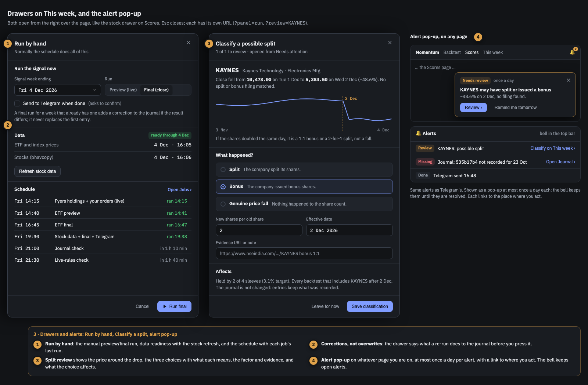
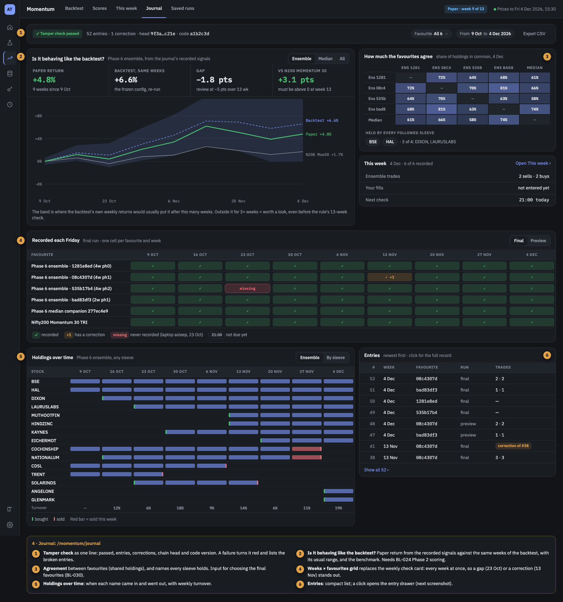
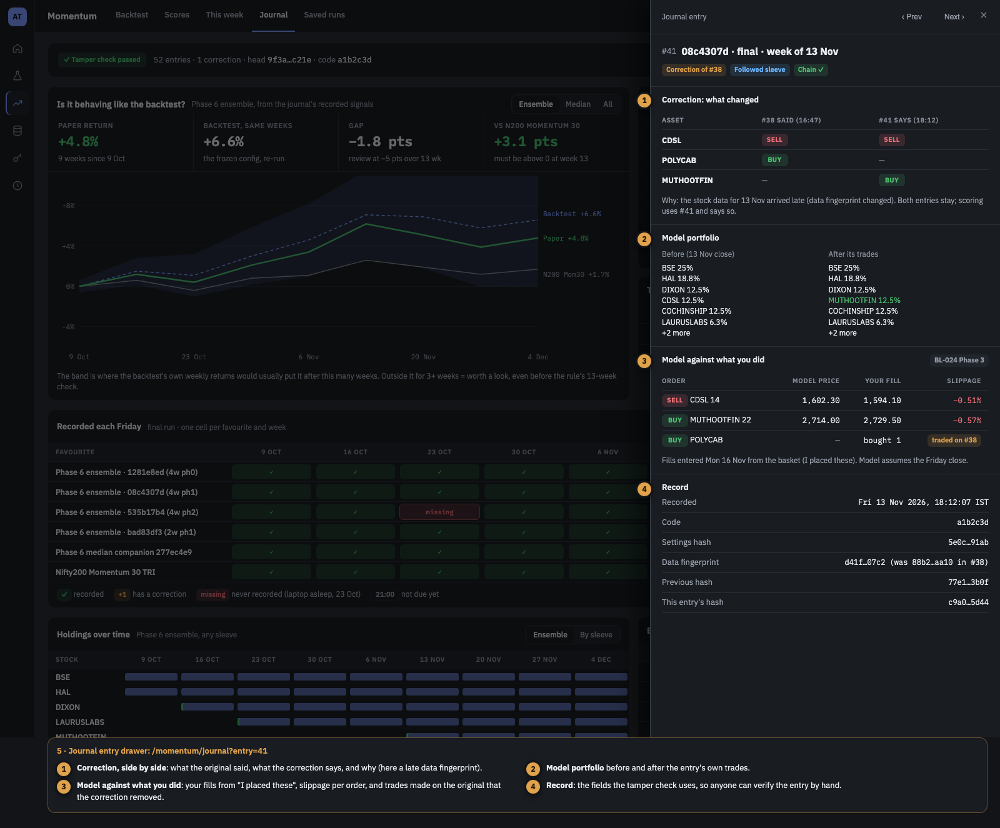
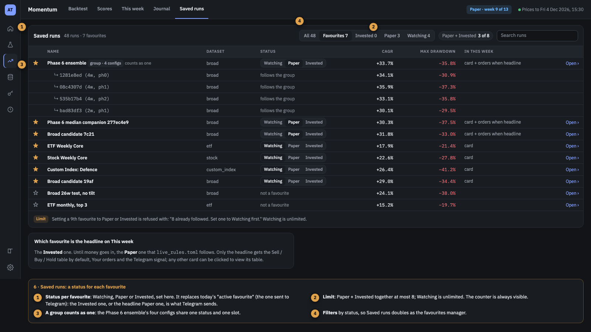

# BL-051 — Momentum "This week" and Journal redesign: favourite statuses, Friday timeline, orders from Fyers holdings, alerts

| | |
|---|---|
| **Priority** | P1 — the page the owner acts on every Friday; paper tracking starts 2026-10-09 and real money will follow the headline favourite (BL-025) |
| **Status** | Planned |
| **Type** | feature |
| **Area** | momentum (backend + dashboard + scheduler) |
| **Created** | 2026-10-08 |
| **Depends on** | BL-024 (journal; its Phase 2 scoring feeds the "behaving like the backtest" chart), BL-025 (live rules), BL-049 (Scores strip, stock drawer, `ui/Drawer`) |
| **Supersedes** | BL-003 (loading states, absorbed into Phase 2) and BL-027 (basket file, absorbed into Phase 4) |
| **TODO.md row** | — (filled in when started) |

## Context

Three Momentum pages cover the Friday routine today:

- **Weekly signal** (`components/momentum/MomentumWeeklyView.tsx`): readiness card, manual run,
  send to Telegram, schedule and saved signals, one result card per favourite, and the possible
  split/bonus review.
- **Rebalance preview** (`MomentumRebalanceView.tsx`): pick a strategy, type or paste your holdings
  as percentages each time, and see indicative buy/sell changes.
- **Journal** (`MomentumJournalView.tsx`): summary, this week's check, tamper check and entries.

The owner asked (2026-10-08) for one page that answers "what do I do this Friday": every favourite
visible, the one real money follows first, orders computed from the real holdings, and alerts that
reach any page. The design was settled from mockups in the same session. The seven screens below
use sample data on a future Friday (4 Dec 2026, paper week 9 of 13).

| Screen | Image |
|---|---|
| Page map: pages, drawers, and where today's cards go |  |
| 1 · This week: timeline, rules, favourites carousel, signal |  |
| 2 · This week, lower half: Your orders, holdings from Fyers |  |
| 3 · Drawers (Run by hand, Classify a split) and the alert pop-up |  |
| 4 · Journal |  |
| 5 · Journal entry drawer |  |
| 6 · Saved runs with a status per favourite |  |

### The design in brief

- **Tabs** become Backtest · Scores · **This week** · Journal · Saved runs. Weekly signal and
  Rebalance preview merge into This week (`/momentum/week`); `/momentum/weekly` redirects there and
  `/momentum/rebalance` to `/momentum/week#orders`. The Overview card's link follows.
- **Favourite status** on Saved runs: **Watching**, **Paper** or **Invested**. Favourites are
  unlimited; Paper + Invested together are at most **8** (a 9th is refused with "8 already
  followed. Set one to Watching first."). Every favourite is journalled every Friday, as now.
- **Groups:** several saved configs can form one favourite that shares one status and one slot.
  The **Phase 6 ensemble** (the BL-010 frozen four: 1281e8ed 4w ph0, 08c4307d 4w ph1, 535b17b4
  4w ph2, bad83df3 2w ph1) is the first group. Each config is a **sleeve**; only the sleeves whose
  phase falls this week trade.
- **Headline favourite** = the Invested one; until money goes in, the Paper one `live_rules.toml`
  follows. It replaces today's single "active" favourite: Telegram sends it, Your orders are for
  it, and it is the first card on This week.
- **This week, top to bottom:** Friday timeline (14:15 Your orders → 14:40 ETF preview → 16:45 ETF
  final → 19:30 stock data + final + Telegram → 21:00 journal check → 21:30 rules check; on other
  days it shows last Friday and the countdown to the next) with **Run by hand**; **Needs
  attention** (only when something does); the **live-money rules** strip; the **favourites
  carousel** (headline first and larger, then every other favourite with this week's trades,
  return since paper start against its backtest, and names in common with the headline; a click
  selects it); the selected favourite's **Sell / Buy / Hold table** (sleeve chips, Scores 1–10
  strip, rank and weekly change, room to the exit rank, target weight; a row opens the Scores
  stock drawer); **Since your 14:15 orders** (what the 19:30 final changed); **Names at the edge**
  (held names near the exit, candidates just outside the buy zone); the **Telegram message**
  exactly as sent, with Re-send.
- **Your orders** (lower half, headline only): holdings **synced read-only from Fyers** and stored
  per **owner ID** (only `rahul` for now; friends later), totals (value, sells, buys, cash after,
  estimated costs, not traded), a **minimum trade** (default ₹10,000, a per-owner setting), orders in whole
  shares (full exits, trims, buys), SKIP rows with the cost they would have paid, blocked names
  (unclassified split) held, a **Fyers basket file** and **I placed these** (fills stored next to
  the journal entry).
- **Alerts:** each alert (split to classify, data not ready, journal entry missing, rule breached,
  Fyers login expired before 14:15) shows as a pop-up on whatever page is open, at most once a day
  per alert, with a link to where you act; a bell in the top bar keeps open alerts until resolved.
- **Journal:** one-line tamper check; "Is it behaving like the backtest?" (paper return against the
  same weeks of the backtest, its usual range, and the benchmark); how much the favourites agree;
  a weeks × favourites grid (recorded / missing / correction); holdings over time; entries list
  and an entry drawer (correction side by side, model portfolio before and after, model against
  what you did, the record).

## Goal

- On a Friday the owner opens one page and sees every favourite, the headline's trades, their own
  orders from real holdings, and anything that needs a person, without retyping holdings.
- Orders for the headline are ready at 14:15 on live prices, in time to trade before the close.
- Nothing on This week or Journal shows a placeholder that reads as data (BL-003's goal).

## Out of scope

- **Placing orders.** The repo never trades; the owner uploads the basket to Fyers and submits it.
- Logins for friends. Rows carry an owner ID so a second person can be added later; who is signed
  in is not decided here.
- Tax lots and capital-gains planning for the sells.
- Choosing which favourites to track (BL-030) or the rule numbers (BL-025).

## Facts the plan relies on

- **Favourites** live in the shared catalog as saved runs (`runs_store.py`): `summary.favorite`
  and `summary.active` (exactly one active; `update` clears the others). `list_favorites` orders
  the active one first. Routes in `api.py`: `GET/POST /api/saved-runs`, `PATCH
  /api/saved-runs/{id}`, `GET /api/favorite-strategies`.
- **Weekly runs** (`weekly.py` `run_favorite_strategies`) evaluate every favourite and send only the
  active one to Telegram. Scheduler jobs (`apps/scheduler/src/jobs.ts`): `momentum-preview` Fri
  14:40, `momentum-final` 16:45, `momentum-stock-ingest` 19:30 (stocks sync, then the final for
  stock / custom index / **Broad**), `momentum-journal-check` 21:00, `momentum-live-rules` 21:30.
  **The Phase 6 ensemble is Broad, so its final signal is the 19:30 run**, not 16:45.
- **The ensemble** in `live_rules.py` comes from `search_spaces/bl010_phase6_frozen.json` via
  `choose.ensemble_curve`: equal capital per config, reset to equal each April, never rebalanced
  against each other in between. A group's combined target must therefore weight each sleeve by
  its **current value**, not a flat 25%.
- **Rebalance** (`rebalance.py`): `build_plan`, live stock prices (`live_stock_prices`,
  `quote_stock_universe` through `fyers.quotes`), holdings as percentages; route `POST
  /api/rebalance-preview`. No holdings in shares, no costs, no minimum trade today.
- **Fyers** (`fyers.py`): token resolution (`resolve_credentials`), history and quotes only. Reading
  holdings is a new, read-only call; `business.md` says Fyers is used "for market data only" and is
  updated in the same change.
- **Split review**: `stock_actions.py` (`review_snapshot`, `save_review`), routes `GET
  /api/stock-actions`, `POST /api/stock-actions/review`.
- **Journal**: `forward_journal.py`, route `GET /api/journal` (entries per week, check, chain).
- **Proxies**: every new endpoint is added to the Fastify proxy
  (`apps/server/src/server/routes/momentum-backtest.ts`, which drops query strings unless the route
  passes them) and to the direct rewrites in `apps/dashboard/next.config.ts`.
- **Dashboard**: sections in `MomentumBacktestingView.tsx` (`SECTIONS`: weekly, rebalance, journal,
  saved); `ui/Drawer.tsx`, `ui/Toast.tsx` (`toast()`), Scores `ScoreStrip` and `StockDrawer`
  (BL-049); Guide pages `guide/content/momentum/{weekly-signal,rebalance,journal,saved-runs,
  walkthrough-weekly-signal}.md`; e2e `e2e/momentum-chart.spec.ts` (not in CI).
- Next free migration in `packages/trading-data`: `011_*.sql`.

## Plan

Each phase is one PR, reviewed and merged before the next.

### Phase 1 — Favourite status, groups and the headline (backend + Saved runs)
- **Tasks:**
  - `summary.status` ∈ `watching | paper | invested` (a favourite always has one; `favorite`
    stays as "has a status"), `summary.headline` replaces `active` (exactly one; must be Paper or
    Invested). Limit Paper + Invested ≤ 8 in `runs_store.update`, returned as HTTP 409 with the
    message above. Migration: today's active favourite → headline + Paper; other favourites →
    Watching.
  - **Groups**: a saved run of kind `group` holding member run IDs; members inherit its status and
    use no slot of their own. `weekly.py` runs a favourite (or sleeve) only on its own rebalance
    weeks (`rebalance_every` / `rebalance_offset`); on other Fridays it records a "no rebalance
    this week" journal entry with the holdings carried over, and the journal check expects that
    entry instead of a full one. On its weeks it runs each member, records one journal entry per member
    (unchanged), and builds the group's combined target from each sleeve's current value (the
    `ensemble_curve` convention). One Telegram message for a group headline: sleeves trading this
    week, combined sells / buys, holds. Create the "Phase 6 ensemble" group from the four frozen
    configs; point `live_rules.py` at the headline group instead of reading the frozen JSON
    directly (same four configs, so the numbers do not change).
  - **Saved runs page**: status switch per row, filters (All / Favourites / Invested / Paper /
    Watching), the "Paper + Invested n of 8" counter, group rows with their members, "Make a group"
    from selected runs, headline choice.
- **Deliverables:** runs_store + API changes, weekly group handling, Saved runs UI, Python and
  Vitest tests, Guide `saved-runs.md` and glossary (status, group, sleeve, headline).
- **Done when:** a `mbt weekly --run final` with the group as headline sends one message whose
  combined target equals the value-weighted mean of the four sleeves (test); a 9th Paper favourite
  is refused; `mbt journal check` still passes; `live-rules check` gives the same numbers as before.

### Phase 2 — This week: the signal half (absorbs BL-003)
- **Tasks:**
  - Route `/momentum/week`, redirects from `weekly` and `rebalance`, tab rename, Overview link.
  - `GET /api/week?week=` returning per favourite: status, sleeves and which trade, actions with
    rank / weekly change / exit rank / target weight, the message body, and names at the edge
    (from the Scores payload's composite ranks); `GET /api/live-rules` returning the
    `live_rules.run_check` report as JSON without sending.
  - Friday timeline from `/weekly/status` schedule and run history (late and failed states), Needs
    attention (stock actions, data not ready, journal missing after its run), rules strip,
    favourites carousel, selected favourite's table (Scores strip, room to exit, stock drawer),
    "Since the preview" diff (ETF from the 14:40 preview until Phase 3 adds the 14:15 snapshot),
    Telegram card with Re-send (confirm first), Run by hand drawer, Classify a split drawer.
  - Loading skeletons everywhere; no default text that reads as an answer (BL-003's findings).
- **Deliverables:** endpoints + proxy + rewrites, the page, tests, Guide `weekly-signal.md`
  rewritten as `this-week.md` (registry entry) and the walkthrough updated, e2e spec.
- **Done when:** every card of today's Weekly signal page has a home (page map table), Back works
  for the drawers (`?panel=run`, `?review=SYMBOL`, `?stock=SYMBOL`), the page is usable on a
  Friday evening with real data, and no loading state shows a value.

### Phase 3 — Your orders, holdings from Fyers, and the 14:15 step
- **Tasks:**
  - Migration `011_momentum_holdings.sql`: `momentum_holdings` (owner, synced_at, source, symbol,
    qty, avg_price), `momentum_holding_rules` (owner, symbol, treatment: exclude / cash, extra cash),
    `momentum_orders` (owner, week, favourite id, prices as-of, rows JSON, created_at). Owner ID
    from `MOMENTUM_OWNER` (default `rahul`).
  - `fyers.holdings(creds)` (read-only); sync on demand and in the job; paste / CSV fallback when
    the token is missing or expired.
  - Orders engine on top of `rebalance.build_plan`: holdings in shares, whole shares rounded down,
    full exits then trims then buys, minimum trade (₹10,000 default, stored per owner in a
    `momentum_owner_settings` row and editable on the Your orders section), less-than-one-share skips,
    blocked names held, costs from the engine's itemised cost model.
  - Scheduler job `momentum-orders` Fri 14:15: sync holdings, compute the headline's orders on live
    prices (Broad included), store them, Telegram a short "Your orders" summary; alert if the Fyers
    token is not valid.
  - Your orders section, Holdings from Fyers panel and Edit drawer; "Since your 14:15 orders" now
    compares the stored 14:15 orders with the 19:30 final.
  - `business.md`: Fyers is used for market data and **read-only holdings**; still no orders.
- **Deliverables:** migration, Fyers call, orders engine + tests (rounding, skips, blocked, costs),
  job + scheduler tests, UI, Guide page for Your orders.
- **Done when:** on a real Friday the 14:15 job stores orders that match what the page shows, the
  holdings sync reads the owner's Fyers account, and the job finishes before 14:30.

### Phase 4 — Fyers basket file and "I placed these" (absorbs BL-027)
- **Tasks:** confirm Fyers' basket import format and export it (sells first); "I placed these"
  stores fills (`momentum_fills`: owner, journal entry, symbol, side, qty, price, filled_at,
  source) with edit before saving; optionally read the Fyers tradebook (read-only) to prefill.
- **Done when:** a basket file imports into Fyers without edits, and one week's fills show on the
  journal entry with slippage against the model price.

### Phase 5 — Alerts: pop-up and bell
- **Tasks:** `GET /api/alerts` (id, kind, severity, title, detail, link, opened_at, resolved_at)
  from the same checks the Telegram jobs use; a bell in the top bar (`App.tsx` shell) listing open
  alerts; a pop-up on any page at most once a day per alert ("Review ›", "Remind me tomorrow",
  remembered per browser); resolved when the underlying check clears.
- **Done when:** an unclassified split shows the pop-up once on any page, its link opens the split
  drawer on This week, and classifying it clears the bell.

### Phase 6 — Journal redesign
- **Tasks:** one-line tamper check, favourite and date filters, weeks × favourites grid (final /
  preview), holdings over time with turnover, agreement between favourites, entries list and the
  entry drawer (correction side by side, model portfolio before and after, fills from Phase 4,
  record fields). "Is it behaving like the backtest?": the headline from `live_rules.paper_curves`
  now; every favourite once BL-024 Phase 2 scoring exists; the band from the backtest's own returns
  over the same number of weeks.
- **Done when:** a missing week and a correction stand out in the grid, an entry's drawer shows
  the correction against the original, and the chart matches `mbt live-rules check` for the
  headline.

## Risks

- **14:15 runtime.** A Broad run on live prices is the slow path (BL-039). If it cannot finish by
  ~14:30, the job computes the headline only and the others wait for 19:30.
- **Group arithmetic.** A flat 25% per sleeve would drift from `live_rules`' ensemble. Test the
  combined target against `choose.ensemble_curve` on the same weeks.
- **Fyers token.** The 08:05 login job must have run; otherwise the job alerts and the page offers
  paste / CSV.
- **Catalog writes from several jobs** (DuckDB single writer): the 14:15 job writes holdings and
  orders while the dashboard reads; use the cross-process lock planned in BL-047 or short write
  transactions with retry.
- **Paper stage.** Until money goes in, the owner's Fyers account does not hold the strategy, so
  Your orders runs against the journal's paper portfolio (owner, 2026-10-08), with a switch to
  the real holdings.
- **Off-week journal entries** change BL-024's "every favourite every Friday" record: the entry
  still exists every Friday, but off weeks carry the holdings rather than re-run the strategy.
  The tamper chain and the 21:00 check must treat both kinds.

## Open questions

Answered by the owner on 2026-10-08 (see the Log):

1. ~~Paper stage: real holdings or the paper portfolio?~~ **The journal's paper portfolio** until the
   first Invested favourite exists, with a switch to the real Fyers holdings.
2. ~~Minimum trade default?~~ **₹10,000**, configurable: a per-owner setting edited on the Your
   orders section. Top-ups and trims smaller than that are skipped; full exits and new buys always
   go through.
3. ~~14:15 orders on Telegram?~~ **Yes**, a short "Your orders" message as well as the dashboard.
4. Fyers basket format: confirmed when Phase 4 starts.
5. ~~Do Watching favourites run every Friday?~~ **Every favourite runs on its own rebalance weeks
   only**: a 4-week config (or sleeve) runs once every 4 weeks, on its phase. On its other Fridays
   nothing is run; its holdings carry over and the journal records a cheap "no rebalance this week"
   entry (holdings carried, no backtest), so the 21:00 check does not report it missing.

## Log

- 2026-10-08 — created from the design session; mockups approved by the owner. Owner's answers:
  keep every idea; Weekly signal and Rebalance merge into This week, Journal stays its own page;
  favourites unlimited, with a status Watching / Paper / Invested and Paper + Invested at most 8;
  the invested favourite first, then the others in a horizontal carousel; holdings in the database
  with an owner ID so friends can be added later (only the owner now); alerts as a once-a-day
  pop-up with a link, split review stays on This week; broker is **Fyers**; a **14:15** step
  computes the rebalance from Fyers data; the timeline is a Friday thing. Accepted defaults
  proposed by Claude: a group counts as one favourite; Your orders only for the headline; the
  `business.md` Fyers line is updated when holdings are read.
- 2026-10-08 — supersedes BL-003 (Phase 2) and BL-027 (Phase 4).
- 2026-10-08 — owner answered: paper portfolio for Your orders until something is Invested; the
  14:15 orders also go to Telegram; every favourite runs only on its own rebalance weeks (a 4-week
  config every 4 weeks).
- 2026-10-08 — owner: minimum trade ₹10,000 by default, configurable.
