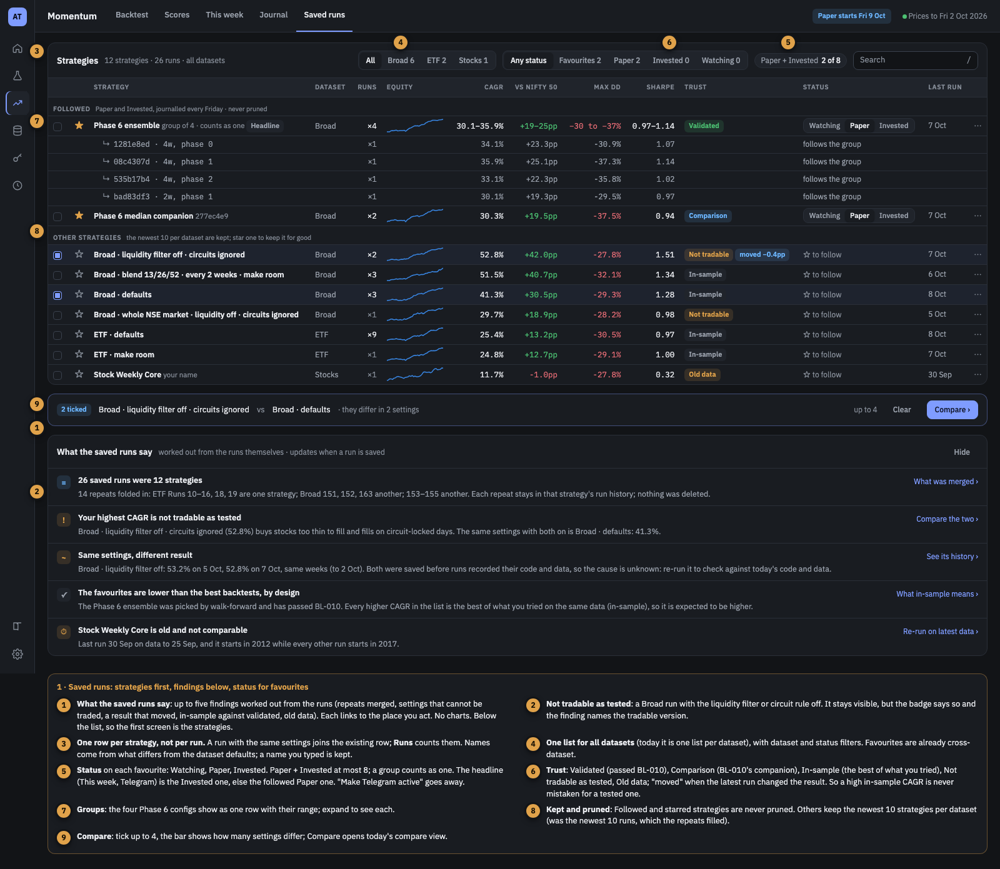
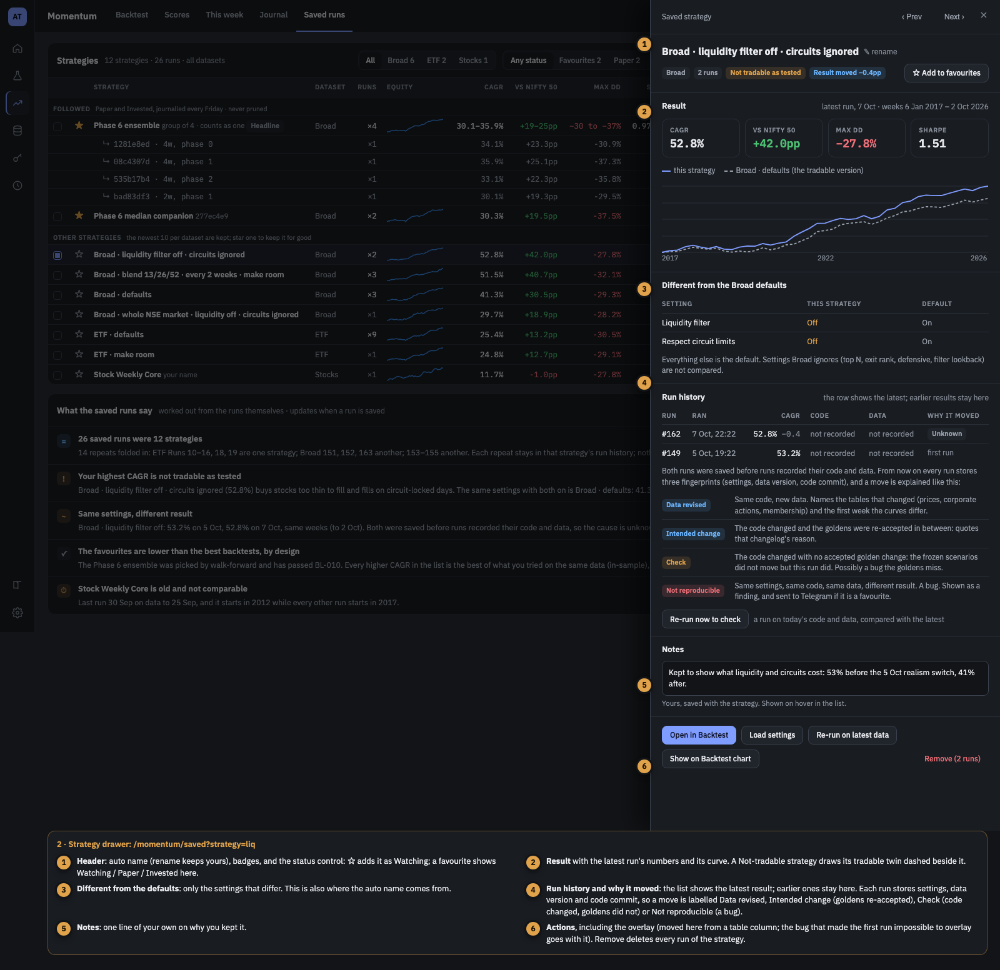
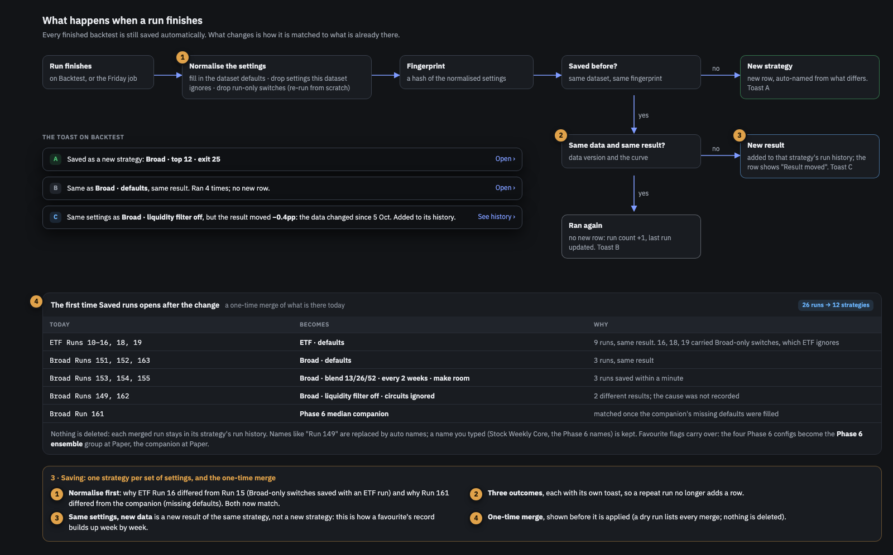

# BL-052 — Momentum Saved runs: one row per strategy, why a result moved, findings

| | |
|---|---|
| **Priority** | P2 — the workbench page where favourites are chosen; not on the real-money path, but its "why it moved" check catches results that change for no reason |
| **Status** | Done |
| **Type** | feature |
| **Area** | momentum (backend + dashboard) |
| **Created** | 2026-10-08 |
| **Depends on** | BL-051 Phase 1 (favourite status Watching / Paper / Invested, groups, headline): this item builds on that model rather than restating it. Related: BL-001 (result integrity) |
| **TODO.md row** | 3.12.18 |

## Context

Every finished backtest is saved automatically (`store/momentumRuns.ts` → `POST /api/saved-runs` →
`runs_store.save_run`), one list per dataset (`MomentumSavedRunsView.tsx`). Running the same
settings again adds another row. On 2026-10-08 the catalog held **26 saved runs that were 12
strategies**:

- **Exact repeats:** ETF Runs 10–15 (one settings hash); Broad 151, 152, 163; Broad 153–155.
- **Different hash, same strategy:** ETF Runs 16, 18, 19 carry `broad_liquidity_filter` and
  `broad_respect_circuits`, which ETF ignores; Run 161 is the Phase 6 median companion saved with
  its missing defaults filled in (and `1` where the companion has `1.0`).
- **Same settings, different result:** Broad Runs 149 and 162 (53.2% and 52.8% CAGR, same weeks to
  2 Oct). Neither run recorded its code or data, so the cause cannot be told now.
- **Names** are mostly "Run N", and the ordinary-run cap (10 per dataset, `MAX_RUNS_PER_DATASET`)
  is filled by repeats.

The owner asked (2026-10-08) for one entry per unchanged configuration, a page that looks good,
favourite status in it, findings rather than analytics, and a way to know whether a moved result
is a data revision or a bug. Mockups approved in the same session; they use the real 26 runs.

| Screen | Image |
|---|---|
| 1 · Saved runs: strategies first, compare bar, findings below |  |
| 2 · Strategy drawer: differences from the defaults, run history, why it moved |  |
| 3 · What happens when a run finishes, and the one-time merge |  |

### The design in brief

- **One row per strategy, not per run.** A run's settings are normalised (dataset defaults filled
  in, settings the dataset ignores dropped, run-only switches such as `fresh` dropped, numbers
  canonical so `1` equals `1.0`) and hashed. Same dataset + same hash = same strategy.
- **Three outcomes when a run finishes**, each with its own toast on Backtest: **new strategy**
  (new row), **ran again** (the same result: run count +1, no new row), **new result** (a
  different result: added to that strategy's run history; the row shows the latest and "moved
  −0.4pp"). The outcome is decided by the result alone: the same curve on a new data version
  (an ETF refresh changes the version a Broad rerun sees without changing its result) is **ran
  again**, its new data version is recorded, and no change is logged.
- **Saving stays automatic** (owner, 2026-10-08).
- **Why it moved.** Every run stores three fingerprints: settings hash, data version
  (`db_read.data_version()` / `api.input_version()`) and code commit (`journal.code_commit()`).
  A moved result is labelled:
  - **Data revised**: same code, new data. Names the tables whose fingerprint changed and the
    first week the two curves differ.
  - **Intended change**: the code changed and `tests/golden/CHANGELOG.md` has an accepted entry
    between the two commits that moved a scenario **of the same dataset** (the changelog names
    each scenario; its prefix is the dataset). Quotes that entry's reason. An accepted change to
    another dataset explains nothing here: an accepted Broad change cannot hide an ETF move.
  - **Check**: the code changed with no accepted same-dataset golden change in between. The
    frozen scenarios of this dataset did not move, but this run did: possibly a bug the goldens
    miss. Data and code both changed counts as Check too, never Data revised.
  - **Not reproducible**: same settings, code and data, different result. A bug. Shown as a
    finding and sent to Telegram when the strategy is a favourite.
  - **Unknown**: a run saved before the fingerprints existed (all 26 today).
  "Re-run now to check" re-runs on today's code and data and compares with the latest.
- **Every change is logged in the backend.** Each moved result appends a row to a new
  `momentum_result_changes` table (append-only): when, strategy, dataset, both run ids, the three
  fingerprints of each, the label, the changed tables, the first differing week, and the
  before/after kpis. The same record goes to the service log as one JSON line. This is the record
  later analytics reads; nothing is ever updated or deleted in it.
- **Where a change shows up** (so it is seen without opening Saved runs):
  - the **toast** on Backtest the moment the run finishes ("the result moved −0.4pp: data revised");
  - the **row badge** ("moved −0.4pp", amber for Check, red for Not reproducible) and the drawer's
    Why it moved;
  - a **count on the Saved runs tab** while any Check or Not reproducible change is unreviewed;
  - the **alert pop-up and bell** from BL-051 for Check and Not reproducible, linking to the
    strategy drawer, with "Mark reviewed";
  - **Telegram** for Not reproducible on a favourite;
  - the **findings** card.
  "Mark reviewed" stores who and when in the log row, so the count goes to zero without hiding the
  history.
- **Auto names** from what differs from the dataset defaults ("Broad · liquidity filter off ·
  circuits ignored"). A name the owner typed is kept.
- **Trust badge** per row: **Validated** (passed BL-010: the frozen Phase 6 configs), **Comparison**
  (the median companion), **In-sample** (the best of what was tried on the same data), **Not
  tradable** (Broad with the liquidity filter or circuit rule off), **Old data** (data well behind
  the newest, or a different start from the rest).
- **One list for all datasets** with dataset and status filters, the "Paper + Invested n of 8"
  counter, and search (`/`). Sections **Followed** (Paper and Invested, never pruned) and **Other
  strategies** (the newest 10 per dataset kept; a star keeps one for good). Groups (BL-051) show as
  one row with their members' range, expandable.
- **Status control** on each favourite (Watching / Paper / Invested) as defined in BL-051 Phase 1;
  "Make Telegram active" goes away.
- **Strategy drawer** (`?strategy=<id>`): header with rename, badges and status; latest result
  with its curve (a Not-tradable strategy draws its tradable twin dashed); settings that differ
  from the defaults; run history with Code, Data and Why it moved; a notes line; actions Open in
  Backtest, Load settings, Re-run on latest data, Show on Backtest chart, Remove (all runs).
- **Compare** stays: tick up to 4; a bar under the list says how many settings differ.
- **Findings** below the list (the first screen is the strategies, owner 2026-10-08): up to five
  lines worked out from the runs, each linking to where to act. No charts.
- **One-time merge** of what is there, shown as a dry run first; nothing is deleted.

## Goal

- The 26 runs of 2026-10-08 show as 12 strategies (9 rows with the Phase 6 group), and re-running
  any of them adds no row.
- Every run saved after Phase 1 has a settings hash, data version and code commit, and every moved
  result has one of the labels above.
- A favourite whose result moves with no data or code change produces a Telegram alert.
- Every moved result has one row in `momentum_result_changes`, and an unreviewed Check or Not
  reproducible change is visible on the Saved runs tab from any page (bell) until marked reviewed.
- In a 1600×1000 window the strategies list is the first thing on the page.

## Out of scope

- Favourite status, groups, the headline and the 8 limit: BL-051 Phase 1.
- Charts or analytics of the saved runs (owner: findings only).
- Keeping old data snapshots to re-run a past result on its original data. The labels attribute a
  move from fingerprints; they do not reproduce the old run.
- Sharing saved runs or statuses between people. The owner ID BL-051 adds applies when friends
  are added.

## Facts the plan relies on

- `runs_store.py`: strategy = one `strategies` row per dataset (`momentum:<dataset>`); version =
  `strategy_versions` row keyed `dataset:spec_hash` (12-character SHA-256 of `json.dumps(config,
  sort_keys=True)`); each run = a `backtest_runs` row with everything in `summary` JSON (name, n,
  kpis, dates, strategy curve, overlay, favorite, active). `_prune` keeps 10 ordinary runs per
  dataset. `update_run` clears every other `active` across datasets.
- The journal and weekly job refer to favourites by run `id` (`forward_journal.py:326`,
  `weekly.py:693`): a merge must keep each favourite's id stable.
- Dataset defaults are built in `api.py`'s meta functions (`defaults` blocks at ~818, ~924, ~1180,
  ~1464); the Broad block lists the keys Broad ignores (`top_n`, `exit_rank`, `defensive`,
  `filter_lookback`). The dashboard's `completeConfig` / `differingSettings` /
  `settingLabel` / `formatSettingValue` are in `lib/momentumCompare.ts`.
- `fresh` (`api.py:538`) is a run-only switch, never part of a saved config.
- `db_read.data_version()` and `table_fingerprints` (BL-005) give a content version of the data;
  `journal.code_commit()` gives the commit; `tests/golden/CHANGELOG.md` records every accepted
  result change with its reason; `scripts/result-baseline.py compare` already reports "did the data
  change" for favourites.
- The Backtest chart drops the first saved run from overlays
  (`MomentumBacktestingView.tsx:460`, `index > 0`), which is why one row's overlay box is disabled
  today.
- Frozen Phase 6 configs: `search_spaces/bl010_phase6_frozen.json` (and its median companion).

## Plan

Each phase is one PR, reviewed and merged before the next. Built after BL-051 Phase 1 merges
(both change `runs_store.py`).

### Phase 1 — One strategy per normalised config, fingerprints, the merge (backend)
- **Tasks:**
  - `normalise(dataset, config)`: fill the dataset defaults (one source shared with the meta
    endpoints, not a copy), drop the keys the dataset ignores (a per-dataset list next to the
    defaults), drop run-only keys, canonical numbers. `spec_hash` hashes the normalised config.
  - Strategy record per version: name (auto or typed, with a flag), notes, overlay, and the
    BL-051 status fields, which move from the run summary to the strategy. Runs keep their own
    kpis, curve, `data_version`, `data_through`, `code_commit`.
  - `save_run` returns `{outcome: new | repeat | new_result, strategy, run}`. `repeat` = the same
    curve and kpis within a tolerance, whatever the data version (a fingerprint that moved with
    an unchanged result is stored on the run, not logged as a change); `new_result` = a different
    curve. Test both, including a rerun after a refresh of another dataset's data.
  - `explain(previous_run, run)` → `data_revised | intended | check | not_reproducible | unknown`,
    with the changed table names, the first differing week and, for `intended`, the golden
    changelog reason. `intended` requires an accepted entry between the two commits whose
    scenarios include this strategy's dataset; otherwise `check`. Tests: an ETF move with only a
    Broad entry in between is `check`; code and data both changed is `check`. `not_reproducible` on a favourite sends a Telegram alert through
    `notify.py`.
  - `momentum_result_changes` (trading-data migration): append-only, written in the same
    transaction as the run that moved. Add it, and the new strategy-record table, to
    `db_read.RUN_RECORD_TABLES`: `table_fingerprints()` hashes every other table, so without this
    the first change row would itself move the next run's data version, and an identical rerun
    would read as Data revised instead of Not reproducible (test this); a `reviewed_at` / `reviewed_by` pair is the only thing set
    later. One JSON log line per change. `GET /api/result-changes?unreviewed=1` and
    `POST /api/result-changes/{id}/reviewed`.
  - Prune by strategy: keep the newest 10 non-kept strategies per dataset (kept = followed,
    starred or overlay); a strategy's own run history keeps every result change and the last 3
    repeats.
  - `trust` per strategy (validated / comparison / in-sample / not tradable / old data) on the
    server, since it reads the frozen file.
  - Auto name from the normalised config against the defaults, at most three differences, in
    settings-panel order.
  - `mbt saved merge [--dry-run]`: folds today's runs into strategies, keeps every run and every
    favourite's id, replaces "Run N" names with auto names, keeps typed names. The dashboard shows
    the dry-run list before it is applied.
  - API: `GET /api/saved-strategies` (all datasets), `GET /api/saved-strategies/{id}` (with runs),
    `PATCH` (name, notes, overlay, status via BL-051's rules), `DELETE` (every run), `POST
    /{id}/rerun`. `/api/saved-runs` keeps answering for Backtest overlays and This week until
    Phase 2 moves them. Fastify proxy and Next rewrite entries.
- **Deliverables:** runs_store + api changes, the merge command, Python tests including a fixture
  of the real 26 runs → 12 strategies, `explain` cases for all five labels, and a test that every
  pair of golden scenarios with different results gets different hashes.
- **Done when:** the dry run on the live catalog lists exactly the merges in screen 3; after the
  merge `mbt journal verify`, `mbt journal check` and `live-rules check` give the same answers as
  before; running a saved strategy again returns `repeat`.

### Phase 2 — The Saved runs page and the drawer (dashboard)
- **Tasks:**
  - The list: one row per strategy across datasets, Followed / Other sections, dataset and status
    filters, search, sorting, Runs column, sparkline, CAGR, against the benchmark, max drawdown,
    Sharpe, trust and "moved" badges, status control, last run, ⋯ menu; group rows with members.
  - Compare bar (up to 4, how many settings differ) opening today's compare view.
  - Strategy drawer on `components/ui/Drawer.tsx` with `?strategy=` (Back closes it): everything in
    screen 2, including Why it moved and Re-run now to check.
  - Toasts A / B / C on Backtest from the save outcome.
  - The unreviewed-change count on the Saved runs tab, and the BL-051 alert pop-up / bell entries
    for Check and Not reproducible (with Mark reviewed). If BL-051's alert phase is not merged yet,
    the tab count ships first and the bell entry follows it.
  - Overlay moves to the drawer and the ⋯ menu; remove the `index > 0` skip so any run can be
    overlaid.
  - Guide `saved-runs.md` rewritten; glossary: strategy, run, in-sample, trust labels, result moved.
- **Deliverables:** the page, the drawer, `lib/momentumSaved.ts` (pure helpers) with Vitest tests,
  e2e spec, Guide.
- **Done when:** every element in screens 1 and 2 works on the live catalog, the list is the first
  screen at 1600×1000, and re-running a strategy on Backtest shows toast B without a new row.

### Phase 3 — Findings
- **Tasks:** the five rules as pure, tested functions over the strategy list: repeats merged (from
  the merge record), not tradable with its tradable twin when one is saved, result moved (Check
  and Not reproducible first), in-sample against validated, old data. Card below the compare bar,
  at most five lines, each with its link; "Hide" remembered per browser.
- **Deliverables:** the rules, the card, tests, Guide section.
- **Done when:** on the live catalog the card shows the five findings of screen 1 (with the
  149/162 move as Unknown) and each link opens the right place.

## Risks

- **A wrong merge** joins two strategies that differ. Mitigations: dry run first; nothing deleted,
  so a wrong merge can be split; the golden-pairs test; a key is dropped only if the dataset's own
  list says it is ignored.
- **Normalising changes the hash of existing favourites.** The journal keys on run id, not hash;
  keep ids stable and test journal verify/check after the merge.
- **"Same result" tolerance.** Too loose hides real moves; too tight calls float noise a move.
  Compare the curve at a fixed precision (e.g. relative 1e-9) and test it on repeat runs.
- **Code commit on a dirty tree.** A run from uncommitted code records the commit plus a dirty
  flag and is labelled Check, never Intended.
- **Conflicts with BL-051 Phase 1**, which edits `runs_store.py` and the Saved runs view first.

## Open questions

Answered by the owner on 2026-10-08 (see the Log):

1. ~~Same settings, different result: keep both or the latest?~~ **Show the latest**; earlier
   results stay in the strategy's run history so the move can be explained.
2. ~~Save automatically or on demand?~~ **Automatically**, as now.

3. ~~Telegram alert for Check too?~~ **No.** Only Not reproducible on a favourite goes to
   Telegram; Check shows on the page (row badge, tab count, bell and pop-up, findings).
4. ~~How many repeat runs to keep per strategy?~~ **The last 3 repeats**, plus every result
   change.

## Log

- 2026-10-08 — created from the design session; mockups approved by the owner with one change:
  the strategies list first, the findings below it. Owner's answers: one entry per unchanged
  configuration; findings, no analytics; status as in BL-051; same settings with a new result
  shows the latest, and the owner must be able to tell a data revision from a bug (the three
  fingerprints and the Why-it-moved labels); saving stays automatic.
- 2026-10-08 — owner: log every result change in the backend for later analytics, and make a
  change visible in the UI. Added `momentum_result_changes`, the tab count, and the bell / pop-up
  entries with Mark reviewed.
- 2026-10-08 — review fixes (PR #132 review): the change log and strategy table are excluded from
  the data fingerprint (`RUN_RECORD_TABLES`); the same result on a new data version is "ran
  again", not a change; "Intended change" needs an accepted golden change of the same dataset,
  and code plus data changing together is "Check".
- 2026-10-08 — owner answered the last two questions: Check is not sent to Telegram (page only);
  keep the last 3 repeat runs per strategy, plus every result change.
- 2026-10-08 — started. No new questions: every open one was answered. Phase 1 decisions from
  reading the code:
  - **Strategy state stays on an anchor run** (the favourite run, else the oldest) instead of a
    new strategy table: the journal, the weekly job and BL-051's groups key on run ids, and this
    keeps every one of them stable. A run's own config is now read from `backtest_runs.params`;
    the version's `spec` holds the anchor's raw config (runnable by code from before BL-052,
    which still reads it; normalised Broad settings have no `universe`).
  - **Normalised with the request model's defaults**, not the meta endpoints' UI defaults: they
    are what the engine actually ran with (Broad's meta turns the liquidity filter on, the
    request model leaves it off). The fields each dataset never reads come from the code (a test
    recomputes them from `api.py` and fails if they drift); `weights` count only for the
    `ranksum` score, which is the only one that reads them.
  - **Auto names move to Phase 2** (the dashboard already has the setting labels;
    `name_typed` tells it which names are placeholders). **"Comparison" trust waits** for the
    median companion's config to be recorded next to the frozen file: Phase 1 derives Validated
    (the four frozen configs match exactly), Not tradable, Old data and In-sample. **Re-run now
    to check** moves to Phase 2 (it re-runs through Backtest, whose save gives the outcome).
- 2026-10-08 — Phase 1 code review (#138): 10 findings, all fixed (commit ids checked before git,
  tool state under `data/` no longer moves the data version, a strategy holding a group member
  cannot be deleted, overlays get no alert, and others in the PR comment). Before applying the
  merge: the scheduler's checkout and the running service still run pre-BL-052 code, which reads
  each run's config from `strategy_versions.spec`, so the version keeps the anchor's raw config.
  Rehearsed on a copy of the live catalog: 26 runs → 12 strategies, and the favourites' configs
  are byte-identical before and after, read by the old code and the new.
- 2026-10-08 — Phase 1 merge applied to the live catalog after a backup
  (`catalog.pre-bl052-merge.duckdb`): 26 runs → 12 strategies, favourites' configs unchanged.
  Phase 2 started on a branch stacked on Phase 1. Decisions: the drawer opens with `?strategy=`
  through `useQueryState` like This week's drawers (Esc closes it; Back does not); the BL-051
  alert bell does not exist yet (its Phase 5), so the Saved runs tab carries the count of
  unreviewed Check / Not reproducible changes and the bell entry waits for it; the Backtest
  chart now leaves out the overlay of the strategy on screen by fingerprint (the old "skip the
  first run in the list" rule hid an arbitrary run); the drawer draws the strategy's own curve
  only (no tradable twin yet: that needs the twin found by settings, left for Phase 3's findings).
- 2026-10-08 — Phase 2 merged (#139, with two rounds of review fixes: re-run seeds the form from
  the strategy's full config, removing or pruning a strategy closes its open changes, overlays are
  strategy-wide, a small /saved-strategies/summary feeds the tab label). Checked in the browser on
  the live catalog.
- 2026-10-08 — Phase 3 done: the findings card (`lib/momentumFindings.ts`, tested) below the list
  and the compare bar, at most five lines, Hide remembered per browser (`store/momentumSaved.ts`);
  the drawer draws a Not-tradable strategy's tradable version dashed beside it. "Repeats merged"
  is worked out from the strategies (runs against strategies), not a stored merge record. Checked
  against this morning's merged copy of the live catalog: the five findings of screen 1, in order,
  with the 149/162 move as Unknown. By the evening the live catalog itself had changed (the ETF,
  Stock and earlier Broad runs and the median companion were deleted outside this code; ten new
  "Sectors" favourites saved), and there the card shows its one applicable finding.
- 2026-10-08 — closed. Follow-ups, not in this item: the alert bell entry for Check / Not
  reproducible changes belongs to BL-051 Phase 5; the "Comparison" trust badge needs the median
  companion's config recorded next to the frozen file; automatic names read the dataset defaults
  from `/meta`, whose Broad variant builds the price frame on a cold service (split the four meta
  `defaults` blocks into static functions).

